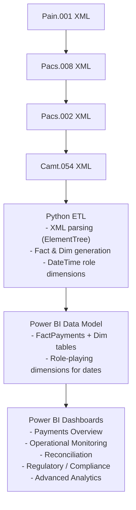
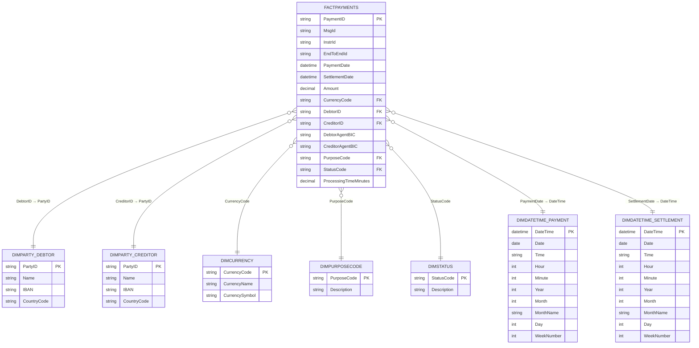

# ISO20022 Payments Dashboard

## 1. Executive Summary

## 2. Index

- [1. Executive Summary](#1-executive-summary )
- [3. Business Fundamentals]
- [4. Dataset Structure]
- [5. Functional Requirements]
- [6. Non-Functional Requirements]
- [5. User Roles]
- [6. Objectives]
- [7. Mission & Core Values]
- [8. Team Structure & User Roles]
- [9. Requirements]
- [10. Entities and Atributes with Data Types]
- [11. Entities Relational Diagram]
- [12. Relational Database]
- [13. Data Seeding]
- [14. SQL Simple Queries]
- [15. SQL Advanced Queries]

## 3. Business Fundamentals

### 🌍 Context

The global payments landscape is undergoing rapid modernization driven by the adoption of the ISO 20022 standard, which provides a richer, structured, and more granular format for financial messages across the payment chain. Banks, payment service providers, and corporates are transitioning to ISO 20022 to support real-time payments, improve reconciliation, and enhance regulatory reporting.

However, ISO 20022 introduces complex hierarchical XML structures and multiple message types (e.g., pain.001, pacs.008, pacs.002, camt.054) that must be linked and analyzed together to provide meaningful business insights. Traditional reporting tools often struggle to handle this complexity efficiently

### 🏦 Business Problem

Financial institutions and corporate treasuries need to answer key operational and strategic questions:

1. Operational Monitoring
    - How many payments were processed today, and what’s the total value?
    - Which corridors or BICs are experiencing delays?
    - Are there unmatched transactions between initiation and settlement?

2. Reconciliation
    - Can we match every pain.001 initiation to a corresponding pacs.008, pacs.002 status, and camt.054 notification?
    - Which transactions failed or are pending settlement?

3. Compliance & Regulatory
    - Are all mandatory fields (LEI, PurposeCode, structured remittance) present?
    - Can we generate corridor-based and high-value transaction reports for regulatory bodies?

4. Strategic Analytics
    - Which payment corridors are growing fastest?
    - What are the trends in settlement times across currencies or geographies?
    - How can we detect anomalies or forecast liquidity flows?

These questions require a unified data model that can integrate and normalize ISO 20022 messages efficiently, enabling real-time monitoring, regulatory compliance, and advanced analytics.

### 💡 Project Objectives

The ISO 20022 Payments Data Analytics project aims to:

1. Centralize ISO 20022 message ingestion (pain.001, pacs.008, pacs.002, camt.054) into a staging layer, followed by structured transformation into a star schema suitable for analytics.
2. Enable end-to-end traceability of transactions using InstrId and EndToEndId as linking keys across all message types.
3. Support operational teams, compliance officers, and data scientists with real-time dashboards and data models that are scalable and easy to extend.
4. Lay the foundation for advanced analytics, including anomaly detection, corridor analysis, high-value transaction monitoring, and forecasting.

### 3.1 Structure of an ISO 20022 Message Name

```bash
<business area>.<message identifier>.<variant>.<version>
```

### 3.2 Payments Codes

- pain - **PA**yment **IN**itiation - Used between customer → bank for initiating payments (e.g., bulk credit transfers, direct debits).
- pacs - **PA**yment **C**learing and **S**ettlement - Used between financial institutions (bank ↔ bank) for interbank payment processing.
- camt - **CA**sh **M**anagemen**t** - Used for account reporting, statements, notifications, and reconciliations.
- reda - **Re**ference **Da**ta - Used for exchanging static reference data like business party info.
- auth - **Auth**orities - Messages exchanged with regulatory or supervisory authorities.

### 3.3 Common Message Identifiers

- pain.001 - Customer Credit Transfer Initiation - Used by corporates/customers to instruct their bank to make credit transfers (e.g., salary batches, supplier payments).
- pacs.008 - FI to FI Customer Credit Transfer - Used between banks to move the actual funds (interbank leg) after initiation.
- pacs.002 - FI to FI Payment Status Report - Provides status updates about interbank payment messages (e.g., accepted, rejected, pending).
- camt.054 - Bank to Customer Debit/Credit Notification - Provides reports of credits and debits booked on the account — often used for automated reconciliation by corporates.

⬆️ [Index](#2-index)

## 4. Dataset Structure

```bash
/ISO20022_Sample_Data/
│
├── pain001/
│   ├── pain001_2025-09-21.xml
│   ├── pain001_2025-09-22.xml
│   └── ...
│
├── pacs008/
│   ├── pacs008_2025-09-21.xml
│   ├── pacs008_2025-09-22.xml
│   └── ...
│
├── pacs002/
│   ├── pacs002_2025-09-21.xml
│   ├── pacs002_2025-09-22.xml
│   └── ...
│
├── camt054/
│   ├── camt054_2025-09-21.xml
│   ├── camt054_2025-09-22.xml
│   └── ...
│
└── README.txt
```

### 4.1 File Structure

#### pain001

```xml
<?xml version='1.0' encoding='utf-8'?>
<Document xmlns="urn:iso:std:iso:20022:tech:xsd:pain.001.001.09">
    <CstmrCdtTrfInitn>
        <GrpHdr>
            <MsgId>PAIN-2025-09-21-Global_Finance_SpA-97dab3c3</MsgId>
            <CreDtTm>2025-09-21T08:00:00Z</CreDtTm>
            <NbOfTxs>192</NbOfTxs>
            <CtrlSum>15914195.66</CtrlSum>
            <InitgPty><Nm>Global Finance SpA</Nm></InitgPty>
        </GrpHdr>
        <PmtInf>
            <PmtInfId>PMTINF-2025-09-21-165141</PmtInfId>
            <PmtMtd>TRF</PmtMtd>
            <ReqdExctnDt>2025-09-21</ReqdExctnDt>
            <Dbtr><Nm>Global Finance SpA</Nm></Dbtr>
            <DbtrAcct><Id><IBAN>SE6510619244403548659086</IBAN></Id></DbtrAcct>
            <DbtrAgt><FinInstnId><BIC>NDEASESSXXX</BIC></FinInstnId></DbtrAgt>
            <CdtTrfTxInf>
                <PmtId>
                    <InstrId>INST-20250921-00000</InstrId>
                    <EndToEndId>E2E-20250921-00000</EndToEndId>
                </PmtId>
                <PmtTpInf>
                    <SvcLvl><Cd>NURG</Cd></SvcLvl>
                    <InstrPrty>NORM</InstrPrty>
                </PmtTpInf>
                <Amt>
                    <InstdAmt Ccy="GBP">1027874.86</InstdAmt>
                </Amt>
                <UltmtDbtr>
                    <Nm>Corp_Initiator_01_00</Nm>
                </UltmtDbtr>
                <CdtrAgt>
                    <FinInstnId>
                        <BIC>HYVEDEMMXXX</BIC>
                    </FinInstnId>
                </CdtrAgt>
                <Cdtr>
                    <Nm>Peter Dubois</Nm>
                    <PstlAdr>
                        <StrtNm>Musterstrasse</StrtNm>
                        <BldgNb>22</BldgNb>
                        <TwnNm>Berlin</TwnNm>
                        <Ctry>DE</Ctry>
                    </PstlAdr>
                </Cdtr>
                <CdtrAcct>
                    <Id>
                        <IBAN>DE7133045310603257969962</IBAN>
                    </Id>
                </CdtrAcct>
                <RmtInf>
                    <Ustrd>Ref 2025-09-0000</Ustrd>
                </RmtInf>
                <Purp>
                    <Cd>SERV</Cd>
                </Purp>
            </CdtTrfTxInf>
        <PmtInf>
    <CstmrCdtTrfInitn>
<Document>
```

#### pacs008

```xml
<?xml version='1.0' encoding='utf-8'?>
<Document xmlns="urn:iso:std:iso:20022:tech:xsd:pacs.008.001.10">
    <FIToFICstmrCdtTrf>
        <GrpHdr>
            <MsgId>PACS008-c12c6a8bf8</MsgId>
            <CreDtTm>2025-09-21T08:58:00+00:00Z</CreDtTm>
            <NbOfTxs>175</NbOfTxs>
        </GrpHdr>
            <CdtTrfTxInf>
                <PmtId>
                    <InstrId>INST-20250921-00000</InstrId>
                    <EndToEndId>E2E-20250921-00000</EndToEndId>
                </PmtId>
                <IntrBkSttlmAmt Ccy="GBP">1027874.86</IntrBkSttlmAmt>
                <IntrBkSttlmDt>2025-09-21</IntrBkSttlmDt>
                <DbtrAgt>
                    <FinInstnId>
                        <BICFI>NDEASESSXXX</BICFI>
                    </FinInstnId>
                </DbtrAgt>
                <CdtrAgt>
                    <FinInstnId>
                        <BICFI>HYVEDEMMXXX</BICFI>
                    </FinInstnId>
                </CdtrAgt>
                <Dbtr>
                    <Nm>Global Finance SpA</Nm>
                </Dbtr>
                <DbtrAcct>
                    <Id>
                        <IBAN>SE6510619244403548659086</IBAN>
                    </Id>
                </DbtrAcct>
                <Cdtr>
                    <Nm>Peter Dubois</Nm>
                </Cdtr>
                <CdtrAcct>
                    <Id>
                        <IBAN>DE7133045310603257969962</IBAN>
                    </Id>
                </CdtrAcct>
                <RmtInf>
                    <Ustrd>Ref 2025-09-0000</Ustrd>
                </RmtInf>
            </CdtTrfTxInf>
        </GrpHdr>
    <FIToFICstmrCdtTrf>
<Document>
```

#### pacs002

```xml
<?xml version='1.0' encoding='utf-8'?>
<Document xmlns="urn:iso:std:iso:20022:tech:xsd:pacs.002.001.10">
    <FIToFIPmtStsRpt>
        <GrpHdr>
            <MsgId>PACS002-ACSC-a64100e0</MsgId>
            <CreDtTm>2025-09-21T10:00:00+00:00Z</CreDtTm>
        </GrpHdr>
        <OrgnlGrpInfAndSts>
            <OrgnlMsgId>PAIN-2025-09-21-Global_Finance_SpA-97dab3c3</OrgnlMsgId>
            <OrgnlMsgNmId>pain.001.001.09</OrgnlMsgNmId>
            <GrpSts>PART</GrpSts>
        </OrgnlGrpInfAndSts>
        <OrgnlPmtInfAndSts>
            <OrgnlPmtInfId>PMTINF-2025-09-21-165141</OrgnlPmtInfId>
            <TxInfAndSts>
                <StsId>STS-ca2be3f2</StsId>
                <OrgnlInstrId>INST-20250921-00081</OrgnlInstrId>
                <OrgnlEndToEndId>E2E-20250921-00081</OrgnlEndToEndId>
                <TxSts>ACSC</TxSts>
                <AccptncDtTm>2025-09-21T10:00:00+00:00Z</AccptncDtTm>
                <OrgnlTxRef><Amt><InstdAmt Ccy="USD">6046.56</InstdAmt></Amt></OrgnlTxRef>
            </TxInfAndSts>
        <OrgnlPmtInfAndSts>
    <FIToFIPmtStsRpt>
<Document>
```

#### camt054

```xml
<?xml version='1.0' encoding='utf-8'?>
<Document xmlns="urn:iso:std:iso:20022:tech:xsd:camt.054.001.08">
    <BkToCstmrDbtCdtNtfctn>
        <GrpHdr>
            <MsgId>CAMT054-3788c0e580</MsgId>
            <CreDtTm>2025-09-21T18:00:00Z</CreDtTm>
        </GrpHdr>
        <Ntfctn>
            <Acct>
                <Id>
                    <IBAN>DE6681088264263617906307</IBAN>
                </Id>
            </Acct>
        <Ntry>
            <Amt Ccy="GBP">64.77</Amt>
            <CdtDbtInd>DBIT</CdtDbtInd>
            <BookgDt>
                <Dt>2025-09-21</Dt>
            </BookgDt>
            <ValDt>
                <Dt>2025-09-21</Dt>
            </ValDt>
            <AddtlNtryInf>SEPA CT Lars Garcia Ref 2025-09-0192</AddtlNtryInf>
        </Ntry>
    <BkToCstmrDbtCdtNtfctn>
<Document>
```

### 4.2 Tag Mapping

#### 4.2.1 pain.001 — Customer Credit Transfer Initiation

| Coluna (destino)         | Tag XML / Descrição                             |
| ------------------------ | ----------------------------------------------- |
| `MessageId`              | `<GrpHdr>/<MsgId>`                              |
| `CreationDateTime`       | `<GrpHdr>/<CreDtTm>`                            |
| `NumberOfTransactions`   | `<GrpHdr>/<NbOfTxs>`                            |
| `ControlSum`             | `<GrpHdr>/<CtrlSum>`                            |
| `InitiatingPartyName`    | `<GrpHdr>/<InitgPty>/<Nm>`                      |
| `PaymentInformationId`   | `<PmtInf>/<PmtInfId>`                           |
| `PaymentMethod`          | `<PmtInf>/<PmtMtd>`                             |
| `RequestedExecutionDate` | `<PmtInf>/<ReqdExctnDt>`                        |
| `DebtorName`             | `<PmtInf>/<Dbtr>/<Nm>`                          |
| `DebtorIBAN`             | `<PmtInf>/<DbtrAcct>/<Id>/<IBAN>`               |
| `DebtorAgentBIC`         | `<PmtInf>/<DbtrAgt>/<FinInstnId>/<BIC>`         |
| `InstructionId`          | `<CdtTrfTxInf>/<PmtId>/<InstrId>`               |
| `EndToEndId`             | `<CdtTrfTxInf>/<PmtId>/<EndToEndId>`            |
| `ServiceLevelCode`       | `<CdtTrfTxInf>/<PmtTpInf>/<SvcLvl>/<Cd>`        |
| `InstructionPriority`    | `<CdtTrfTxInf>/<PmtTpInf>/<InstrPrty>`          |
| `InstructedAmount`       | `<CdtTrfTxInf>/<Amt>/<InstdAmt>` (valor)        |
| `Currency`               | `<CdtTrfTxInf>/<Amt>/<InstdAmt>` atributo `Ccy` |
| `UltimateDebtorName`     | `<CdtTrfTxInf>/<UltmtDbtr>/<Nm>`                |
| `CreditorAgentBIC`       | `<CdtTrfTxInf>/<CdtrAgt>/<FinInstnId>/<BIC>`    |
| `CreditorName`           | `<CdtTrfTxInf>/<Cdtr>/<Nm>`                     |
| `CreditorStreet`         | `<CdtTrfTxInf>/<Cdtr>/<PstlAdr>/<StrtNm>`       |
| `CreditorBuildingNumber` | `<CdtTrfTxInf>/<Cdtr>/<PstlAdr>/<BldgNb>`       |
| `CreditorTown`           | `<CdtTrfTxInf>/<Cdtr>/<PstlAdr>/<TwnNm>`        |
| `CreditorCountry`        | `<CdtTrfTxInf>/<Cdtr>/<PstlAdr>/<Ctry>`         |
| `CreditorIBAN`           | `<CdtTrfTxInf>/<CdtrAcct>/<Id>/<IBAN>`          |
| `RemittanceInformation`  | `<CdtTrfTxInf>/<RmtInf>/<Ustrd>`                |
| `PurposeCode`            | `<CdtTrfTxInf>/<Purp>/<Cd>`                     |

#### 4.2.2 pacs.008 — FI To FI Customer Credit Transfer

| Coluna (destino)            | Tag XML / Descrição                            |
| --------------------------- | ---------------------------------------------- |
| `MessageId`                 | `<GrpHdr>/<MsgId>`                             |
| `CreationDateTime`          | `<GrpHdr>/<CreDtTm>`                           |
| `InstructionId`             | `<CdtTrfTxInf>/<PmtId>/<InstrId>`              |
| `EndToEndId`                | `<CdtTrfTxInf>/<PmtId>/<EndToEndId>`           |
| `InterbankSettlementAmount` | `<CdtTrfTxInf>/<IntrBkSttlmAmt>` (valor)       |
| `Currency`                  | atributo `Ccy` de `<IntrBkSttlmAmt>`           |
| `InterbankSettlementDate`   | `<CdtTrfTxInf>/<IntrBkSttlmDt>`                |
| `DebtorAgentBICFI`          | `<CdtTrfTxInf>/<DbtrAgt>/<FinInstnId>/<BICFI>` |
| `CreditorAgentBICFI`        | `<CdtTrfTxInf>/<CdtrAgt>/<FinInstnId>/<BICFI>` |
| `DebtorName`                | `<CdtTrfTxInf>/<Dbtr>/<Nm>`                    |
| `DebtorIBAN`                | `<CdtTrfTxInf>/<DbtrAcct>/<Id>/<IBAN>`         |
| `CreditorName`              | `<CdtTrfTxInf>/<Cdtr>/<Nm>`                    |
| `CreditorIBAN`              | `<CdtTrfTxInf>/<CdtrAcct>/<Id>/<IBAN>`         |
| `RemittanceInformation`     | `<CdtTrfTxInf>/<RmtInf>/<Ustrd>`               |

#### 4.2.3 pacs.002 — FI To FI Payment Status Report

| Coluna (destino)        | Tag XML / Descrição                           |
| ----------------------- | --------------------------------------------- |
| `MessageId`             | `<GrpHdr>/<MsgId>`                            |
| `CreationDateTime`      | `<GrpHdr>/<CreDtTm>`                          |
| `OriginalMessageId`     | `<OrgnlGrpInfAndSts>/<OrgnlMsgId>`            |
| `OriginalMessageNameId` | `<OrgnlGrpInfAndSts>/<OrgnlMsgNmId>`          |
| `GroupStatus`           | `<OrgnlGrpInfAndSts>/<GrpSts>`                |
| `OriginalPaymentInfoId` | `<OrgnlPmtInfAndSts>/<OrgnlPmtInfId>`         |
| `StatusId`              | `<TxInfAndSts>/<StsId>`                       |
| `OriginalInstructionId` | `<TxInfAndSts>/<OrgnlInstrId>`                |
| `OriginalEndToEndId`    | `<TxInfAndSts>/<OrgnlEndToEndId>`             |
| `TransactionStatus`     | `<TxInfAndSts>/<TxSts>`                       |
| `AcceptanceDateTime`    | `<TxInfAndSts>/<AccptncDtTm>`                 |
| `OriginalAmount`        | `<TxInfAndSts>/<OrgnlTxRef>/<Amt>/<InstdAmt>` |
| `Currency`              | atributo `Ccy` de `<InstdAmt>`                |

#### 4.2.4 camt.054 — Bank To Customer Debit Credit Notification

| Coluna (destino)       | Tag XML / Descrição             |
| ---------------------- | ------------------------------- |
| `MessageId`            | `<GrpHdr>/<MsgId>`              |
| `CreationDateTime`     | `<GrpHdr>/<CreDtTm>`            |
| `AccountIBAN`          | `<Ntfctn>/<Acct>/<Id>/<IBAN>`   |
| `EntryAmount`          | `<Ntfctn>/<Ntry>/<Amt>` (valor) |
| `Currency`             | atributo `Ccy` de `<Amt>`       |
| `CreditDebitIndicator` | `<Ntry>/<CdtDbtInd>`            |
| `BookingDate`          | `<Ntry>/<BookgDt>/<Dt>`         |
| `ValueDate`            | `<Ntry>/<ValDt>/<Dt>`           |
| `AdditionalEntryInfo`  | `<Ntry>/<AddtlNtryInf>`         |

⬆️ [Index](#2-index)

## 5. Functional Requirements

This section defines the functional requirements for the ISO 20022 Payments Analytics project. The system must support the extraction, transformation, loading, and analysis of ISO 20022 payment messages (pain.001, pacs.008, pacs.002, camt.054) into a Power BI dashboard that enables operational, regulatory, and strategic insights.

### 5.1 ETL and Data Processing

- FR1: The system must ingest ISO 20022 XML files (pain.001, pacs.008, pacs.002, camt.054) from the designated data folders.
- FR2: The system must extract key fields from each file type, including identifiers (MsgId, EndToEndId), amounts, dates, BICs, PurposeCode, and StatusCode.
- FR3: The system must normalize dates to ISO 8601 format (YYYY-MM-DDTHH:MM:SS) for PaymentDate and SettlementDate fields.
- FR4: The ETL pipeline must enrich payment records by joining pacs.008 with pacs.002 and camt.054 using EndToEndId to populate settlement date and status information.
- FR5: The ETL must generate a star schema with:
    1. One Fact table: FactPayments
    2. Multiple Dimension tables: Parties (Debtor, Creditor), Currency, Purpose, Status, DateTime (Payment, Settlement)
- FR6: Each table must be exported in .csv format for ingestion into Power BI.

### 5.2 Data Model

- FR7: The FactPayments table must contain one row per transaction, identified by a unique PaymentID (MsgId + InstrId).
- FR8: DimParty tables must maintain distinct keys for Debtor and Creditor to support dual relationships.
- FR9: DimDateTime_Payment and DimDateTime_Settlement must provide temporal granularity down to the minute, with ISO 8601 DateTime as the primary key.
- FR10: All dimension tables must have unique primary keys and be linked to the fact table through foreign keys.

### 5.3 Dashboard Features

- FR11: The system must provide 5 Power BI pages:
    1. Payments Overview — KPIs, trends, maps, and top purpose codes.
    2. Operational Monitoring — daily processing metrics, delays, status breakdown.
    3. Reconciliation — pain.001 vs camt.054 matching via EndToEndId.
    4. Regulatory/Compliance — filters by PurposeCode, corridor analysis, missing data detection.
    5. Advanced Analytics — time-series forecasting, anomaly detection.
- FR12: Each dashboard must support filters for date, currency, status, and purpose.
- FR13: Drill-through navigation must allow users to trace a transaction through its lifecycle: pain.001 → pacs.008 → pacs.002 → camt.054.

### 5.4 Security & Access

- FR14: Row-level security (RLS) must be configurable to restrict data by business unit or region.
- FR15: Different user roles (Executive, Operations, Finance, Compliance, Data Science) must have tailored permissions for viewing, filtering, or exporting reports.

⬆️ [Index](#2-index)

## 6. Non-Functional Requirements

This section defines the performance, security, and operational constraints for the ISO 20022 Payments Analytics project.

### 6.1 Performance

- NFR1: The ETL process must be able to process and transform at least 50,000 XML transactions within 15 minutes, ensuring scalability for high-volume payment datasets.
- NFR2: Power BI dashboards must load and respond to user interactions (filters, slicers, drill-downs) in under 5 seconds for datasets up to 1 million transactions.
- NFR3: Data transformations must be efficient and optimized to avoid redundant parsing of XML nodes.

### 6.2 Data Refresh & Availability

- NFR4: The ETL pipeline must support scheduled data refreshes (e.g., daily or hourly) to keep dashboards up to date with new ISO 20022 files.
- NFR5: Dashboards must maintain at least 99.5% availability during business hours.
- NFR6: The solution must allow incremental refresh in Power BI to avoid full dataset reloads when only new files are added.

### 6.3 Scalability

- NFR7: The system must support scaling to millions of payment records without requiring structural changes to the data model.
- NFR8: The ETL must be modular so that new ISO 20022 message types (e.g., pacs.009) can be integrated with minimal code changes.

### 6.4 Security & Compliance

- NFR9: All files and processed data must comply with GDPR and ISO 27001 standards.
- NFR10: Sensitive identifiers (e.g., IBANs, names) must be masked or pseudonymized in non-production environments.
- NFR11: Access to dashboards must be controlled through Microsoft 365 authentication with role-based access control.

### 6.5 Maintainability

- NFR12: All ETL scripts must be version-controlled (e.g., Git) and documented.
- NFR13: The data model must be self-describing, with consistent naming conventions and metadata for each table and field.
- NFR14: The solution must be easily maintainable by BI developers with standard Python (for ETL) and Power BI skills, without requiring niche technologies.

### 6.6 Reliability & Error Handling

- NFR15: The ETL process must include error logging and validation, flagging malformed XML files or missing required fields.
- NFR16: Failures during extraction or transformation must not corrupt existing outputs; partial failures should be isolated and logged.
- NFR17: The system must provide clear reprocessing mechanisms for failed files without manual data correction.

⬆️ [Index](#2-index)

## 7. Technical Architecture

### 7.1 Technical Architecture Overview

                  ┌────────────────────┐
                  │   Pain.001 XML     │
                  └─────────┬──────────┘
                            │
                  ┌────────────────────┐
                  │   Pacs.008 XML     │
                  └─────────┬──────────┘
                            │
                  ┌────────────────────┐
                  │   Pacs.002 XML     │
                  └─────────┬──────────┘
                            │
                  ┌────────────────────┐
                  │   Camt.054 XML     │
                  └─────────┬──────────┘
                            │
                            ▼
                  ┌──────────────────────────────┐
                  │        Python ETL            │
                  │ - XML parsing (ElementTree)  │
                  │ - Fact & Dim generation      │
                  │ - DateTime role dimensions   │
                  └─────────┬────────────────────┘
                            │
                            ▼
             ┌─────────────────────────────────────┐
             │        Power BI Data Model          │
             │ FactPayments + Dim tables          │
             │ Role-playing dimensions for dates  │
             └─────────┬──────────────────────────┘
                            │
                            ▼
          ┌───────────────────────────────────────────┐
          │            Power BI Dashboards            │
          │ - Payments Overview                       │
          │ - Operational Monitoring                  │
          │ - Reconciliation                          │
          │ - Regulatory / Compliance                 │
          │ - Advanced Analytics                      │
          └───────────────────────────────────────────┘



### 7.2 Technology Stack

| Component                 | Technology / Tool                                                                                |
| ------------------------- | ------------------------------------------------------------------------------------------------ |
| **ETL**                   | Python 3.7+ with `xml.etree.ElementTree`, `pandas`                                               |
| **File Ingestion**        | Local directory / secure network drive (scalable to Azure Data Lake)                             |
| **Storage (Transformed)** | **Microsoft SQL Server** (physical model & schema built in **SSMS**)                             |
| **Data Modeling (ERD)**   | [**Mermaid.js**](https://mermaid.js.org/) — for conceptual & logical diagrams in Markdown/GitHub |
| **BI Layer**              | Microsoft Power BI (Desktop + Service)                                                           |
| **Access Control**        | Power BI Row-Level Security (RLS)                      |
| **Version Control**       | GitHub for ETL scripts, SQL DDL, and documentation                               |

### 7.3 Data Model Principles

- Star Schema — One central Fact table (FactPayments) and multiple Dimension tables (Party, Currency, Status, Purpose, DateTime).
- Role-Playing Dimensions — Separate DimDateTime_Payment and DimDateTime_Settlement to avoid ambiguous date relationships.
- Surrogate Keys — Debtors and Creditors use separate IDs (Dxxxxx / Cxxxxx) to prevent relationship conflicts.
- ISO 8601 Datetime Format — All DateTime fields stored in UTC ISO 8601 format (e.g., 2025-09-21T08:00:00Z).

⬆️ [Index](#2-index)

## 8. User Roles

| Role                            | Dashboard Pages                                                 | Typical Actions                                                                                                                    | Access                                                                      |
|----------------------------------|------------------------------------------------------------------|-------------------------------------------------------------------------------------------------------------------------------------|-----------------------------------------------------------------------------|
| **1. Executive / Management**   | 🟡 Page 1: Payments Overview                                    | • View KPIs, trends, top corridors. • Drill into high-value transactions.                                                      | ✅ View-only (Power BI App or dashboard link)                                |
| **2. Operations Team**          | 🟢 Page 2: Operational Monitoring 🧾 Page 3: Reconciliation | • Monitor daily transactions & delays. • Investigate operational bottlenecks. • Drill through EndToEndId timelines.        | ✅ Viewer role with **date / currency / status filters**                     |
| **3. Finance & Reconciliation** | 🧾 Page 3: Reconciliation                                       | • Match pain.001 vs camt.054. • Resolve unmatched transactions. • Export reports to Excel if needed.                       | ✅ Viewer + Export permissions                                               |
| **4. Compliance / Regulatory**  | 🕵 Page 4: Regulatory / Compliance                              | • Filter by PurposeCode, corridor. • Identify missing LEI or structured remittance. • Export filtered lists for reporting. | ✅ Viewer + Export; may have access to specific RLS (e.g., by jurisdiction). |
| **5. Data Science / Analytics** | 📈 Page 5: Advanced Analytics                                   | • Develop forecasts, anomaly detection. • Run custom Power BI or Python models.                                                | ✅ Contributor or shared dataset access                                      |

⬆️ [Index](#2-index)

## 9. Data Modeling

[Conceptual Model]

### 9.1 Logical Data Model

This document defines the logical data model for the ISO 20022 Payments Data Analytics project.
It specifies the entities, attributes, keys, and relationships required to support analytical dashboards in Power BI and other BI tools.

#### FactPayments

| Attribute             | Data Type           | Key | Description                                                 |
| --------------------- | ------------------- | --- | ----------------------------------------------------------- |
| **PaymentID**         | VARCHAR             | PK  | Unique identifier per transaction (e.g., `MsgId-InstrId`)   |
| MsgId                 | VARCHAR             |     | Message identifier from pacs.008                            |
| InstrId               | VARCHAR             |     | Instruction identifier                                      |
| EndToEndId            | VARCHAR             |     | End-to-end reference linking pain.001 → pacs.008 → camt.054 |
| PaymentDate           | DATETIME (ISO 8601) | FK  | Links to DimDateTime_Payment                                |
| SettlementDate        | DATETIME (ISO 8601) | FK  | Links to DimDateTime_Settlement                             |
| Amount                | DECIMAL(18,2)       |     | Transaction amount                                          |
| CurrencyCode          | VARCHAR(3)          | FK  | ISO 4217 currency code (e.g., EUR, USD)                     |
| DebtorID              | VARCHAR             | FK  | Links to DimParty_Debtor                                    |
| CreditorID            | VARCHAR             | FK  | Links to DimParty_Creditor                                  |
| DebtorAgentBIC        | VARCHAR(11)         |     | BIC of debtor’s bank                                        |
| CreditorAgentBIC      | VARCHAR(11)         |     | BIC of creditor’s bank                                      |
| PurposeCode           | VARCHAR(4)          | FK  | ISO 20022 Purpose Code (e.g., SALA, SUPP)                   |
| StatusCode            | VARCHAR(4)          | FK  | ISO 20022 Status Code (e.g., ACSP, RJCT)                    |
| ProcessingTimeMinutes | DECIMAL(10,2)       |     | Derived: settlement − payment time in minutes               |

#### DimParty_Debtor

| Attribute   | Data Type | Key | Description                                 |
| ----------- | --------- | --- | ------------------------------------------- |
| PartyID     | VARCHAR   | PK  | Unique ID for debtor entity                 |
| Name        | VARCHAR   |     | Name of debtor (individual or organization) |
| IBAN        | VARCHAR   |     | Debtor account IBAN                         |
| CountryCode | CHAR(2)   |     | ISO country code of debtor                  |

#### DimParty_Creditor

| Attribute   | Data Type | Key | Description                                   |
| ----------- | --------- | --- | --------------------------------------------- |
| PartyID     | VARCHAR   | PK  | Unique ID for creditor entity                 |
| Name        | VARCHAR   |     | Name of creditor (individual or organization) |
| IBAN        | VARCHAR   |     | Creditor account IBAN                         |
| CountryCode | CHAR(2)   |     | ISO country code of creditor                  |

#### DimCurrency

| Attribute      | Data Type  | Key | Description               |
| -------------- | ---------- | --- | ------------------------- |
| CurrencyCode   | VARCHAR(3) | PK  | ISO 4217 currency code    |
| CurrencyName   | VARCHAR    |     | Full name of the currency |
| CurrencySymbol | VARCHAR    |     | Symbol (€, $, £)          |

#### DimPurposeCode

| Attribute   | Data Type  | Key | Description                                      |
| ----------- | ---------- | --- | ------------------------------------------------ |
| PurposeCode | VARCHAR(4) | PK  | ISO 20022 Purpose Code                           |
| Description | VARCHAR    |     | Human-readable explanation (e.g., SALA = Salary) |

#### DimStatus

| Attribute   | Data Type  | Key | Description                              |
| ----------- | ---------- | --- | ---------------------------------------- |
| StatusCode  | VARCHAR(4) | PK  | ISO 20022 Status Code (e.g., ACSP, RJCT) |
| Description | VARCHAR    |     | Meaning of the status                    |

#### DimDateTime_Payment

| Attribute  | Data Type           | Key | Description                            |
| ---------- | ------------------- | --- | -------------------------------------- |
| DateTime   | DATETIME (ISO 8601) | PK  | Unique timestamp (to minute precision) |
| Date       | DATE                |     | Calendar date                          |
| Time       | TIME                |     | Time of day                            |
| Hour       | INT                 |     | Hour (0–23)                            |
| Minute     | INT                 |     | Minute (0–59)                          |
| Year       | INT                 |     | Calendar year                          |
| Month      | INT                 |     | Month number (1–12)                    |
| MonthName  | VARCHAR             |     | Month name (January, February, etc.)   |
| Day        | INT                 |     | Day of month                           |
| WeekNumber | INT                 |     | ISO week number                        |

#### DimDateTime_Settlement

| Attribute  | Data Type           | Key | Description                            |
| ---------- | ------------------- | --- | -------------------------------------- |
| DateTime   | DATETIME (ISO 8601) | PK  | Unique timestamp (to minute precision) |
| Date       | DATE                |     | Calendar date                          |
| Time       | TIME                |     | Time of day                            |
| Hour       | INT                 |     | Hour (0–23)                            |
| Minute     | INT                 |     | Minute (0–59)                          |
| Year       | INT                 |     | Calendar year                          |
| Month      | INT                 |     | Month number (1–12)                    |
| MonthName  | VARCHAR             |     | Month name (January, February, etc.)   |
| Day        | INT                 |     | Day of month                           |
| WeekNumber | INT                 |     | ISO week number                        |

#### 9.2 Relational Model



#### 9.3 Physical Model

```sql
-- ===========================================
-- PHYSICAL MODEL - ISO 20022 Payments Data Analytics
-- ===========================================

-- Drop existing tables if needed (be careful in prod)
DROP TABLE IF EXISTS FactPayments;
DROP TABLE IF EXISTS DimParty_Debtor;
DROP TABLE IF EXISTS DimParty_Creditor;
DROP TABLE IF EXISTS DimCurrency;
DROP TABLE IF EXISTS DimPurposeCode;
DROP TABLE IF EXISTS DimStatus;
DROP TABLE IF EXISTS DimDateTime_Payment;
DROP TABLE IF EXISTS DimDateTime_Settlement;

-- ============================
-- DIMENSIONS
-- ============================

CREATE TABLE DimParty_Debtor (
    PartyID        VARCHAR(50) PRIMARY KEY,
    Name           VARCHAR(255),
    IBAN           VARCHAR(34),
    CountryCode    CHAR(2)
);

CREATE TABLE DimParty_Creditor (
    PartyID        VARCHAR(50) PRIMARY KEY,
    Name           VARCHAR(255),
    IBAN           VARCHAR(34),
    CountryCode    CHAR(2)
);

CREATE TABLE DimCurrency (
    CurrencyCode   VARCHAR(3) PRIMARY KEY,
    CurrencyName   VARCHAR(100),
    CurrencySymbol VARCHAR(10)
);

CREATE TABLE DimPurposeCode (
    PurposeCode    VARCHAR(10) PRIMARY KEY,
    Description    VARCHAR(255)
);

CREATE TABLE DimStatus (
    StatusCode     VARCHAR(10) PRIMARY KEY,
    Description    VARCHAR(255)
);

CREATE TABLE DimDateTime_Payment (
    DateTime       TIMESTAMP PRIMARY KEY,
    Date           DATE NOT NULL,
    Time           TIME NOT NULL,
    Hour           INT,
    Minute         INT,
    Year           INT,
    Month          INT,
    MonthName      VARCHAR(20),
    Day            INT,
    WeekNumber     INT
);

CREATE TABLE DimDateTime_Settlement (
    DateTime       TIMESTAMP PRIMARY KEY,
    Date           DATE NOT NULL,
    Time           TIME NOT NULL,
    Hour           INT,
    Minute         INT,
    Year           INT,
    Month          INT,
    MonthName      VARCHAR(20),
    Day            INT,
    WeekNumber     INT
);

-- ============================
-- FACT TABLE
-- ============================

CREATE TABLE FactPayments (
    PaymentID              VARCHAR(100) PRIMARY KEY,
    MsgId                  VARCHAR(100),
    InstrId                VARCHAR(100),
    EndToEndId             VARCHAR(100),
    PaymentDate            TIMESTAMP,
    SettlementDate         TIMESTAMP,
    Amount                 DECIMAL(18,2),
    CurrencyCode           VARCHAR(3),
    DebtorID               VARCHAR(50),
    CreditorID             VARCHAR(50),
    DebtorAgentBIC         VARCHAR(11),
    CreditorAgentBIC       VARCHAR(11),
    PurposeCode            VARCHAR(10),
    StatusCode             VARCHAR(10),
    ProcessingTimeMinutes  DECIMAL(10,2),

    FOREIGN KEY (CurrencyCode) REFERENCES DimCurrency (CurrencyCode),
    FOREIGN KEY (DebtorID) REFERENCES DimParty_Debtor (PartyID),
    FOREIGN KEY (CreditorID) REFERENCES DimParty_Creditor (PartyID),
    FOREIGN KEY (PurposeCode) REFERENCES DimPurposeCode (PurposeCode),
    FOREIGN KEY (StatusCode) REFERENCES DimStatus (StatusCode),
    FOREIGN KEY (PaymentDate) REFERENCES DimDateTime_Payment (DateTime),
    FOREIGN KEY (SettlementDate) REFERENCES DimDateTime_Settlement (DateTime)
);

-- ============================
-- Indexes for performance
-- ============================

CREATE INDEX idx_factpayments_currency ON FactPayments (CurrencyCode);
CREATE INDEX idx_factpayments_debtor ON FactPayments (DebtorID);
CREATE INDEX idx_factpayments_creditor ON FactPayments (CreditorID);
CREATE INDEX idx_factpayments_paymentdate ON FactPayments (PaymentDate);
CREATE INDEX idx_factpayments_settlementdate ON FactPayments (SettlementDate);
CREATE INDEX idx_factpayments_status ON FactPayments (StatusCode);
CREATE INDEX idx_factpayments_purpose ON FactPayments (PurposeCode);
```

### Fact Table

```sql
FactPayments (
    PaymentID              VARCHAR PRIMARY KEY,
    MsgId                  VARCHAR,
    InstrId                VARCHAR,
    EndToEndId            VARCHAR,
    PaymentDate           DATETIME,  -- ISO 8601 (e.g. 2025-09-21T09:00:00)
    SettlementDate        DATETIME,  -- ISO 8601
    Amount                 DECIMAL(18,2),
    CurrencyCode          VARCHAR,
    DebtorID              VARCHAR,
    CreditorID            VARCHAR,
    DebtorAgentBIC       VARCHAR,
    CreditorAgentBIC     VARCHAR,
    PurposeCode          VARCHAR,
    StatusCode           VARCHAR,
    ProcessingTimeMinutes DECIMAL(10,2)
);
```

### Dimensions

```sql
DimParty_Debtor (
    PartyID       VARCHAR PRIMARY KEY,
    Name          VARCHAR,
    IBAN          VARCHAR,
    CountryCode   VARCHAR(2)
);
```

```sql
DimParty_Creditor (
    PartyID       VARCHAR PRIMARY KEY,
    Name          VARCHAR,
    IBAN          VARCHAR,
    CountryCode   VARCHAR(2)
);
```

```sql
DimCurrency (
    CurrencyCode    VARCHAR PRIMARY KEY,
    CurrencyName    VARCHAR,
    CurrencySymbol  VARCHAR
);
```

```sql
DimPurposeCode (
    PurposeCode   VARCHAR PRIMARY KEY,
    Description   TEXT
);
```

```sql
DimStatus (
    StatusCode    VARCHAR PRIMARY KEY,
    Description   TEXT
);
```

```sql
DimDateTime_Payment (
    DateTime     DATETIME PRIMARY KEY,  -- ISO 8601 (e.g. 2025-09-21T09:00:00)
    Date         DATE,
    Time         TIME,
    Hour         INTEGER,
    Minute       INTEGER,
    Year         INTEGER,
    Month        INTEGER,
    MonthName    VARCHAR,
    Day          INTEGER,
    WeekNumber   INTEGER
);
```

```sql
DimDateTime_Settlement (
    DateTime     DATETIME PRIMARY KEY,  -- ISO 8601
    Date         DATE,
    Time         TIME,
    Hour         INTEGER,
    Minute       INTEGER,
    Year         INTEGER,
    Month        INTEGER,
    MonthName    VARCHAR,
    Day          INTEGER,
    WeekNumber   INTEGER
);
```

## Logical Relationships

```sql
ALTER TABLE FactPayments
    ADD FOREIGN KEY (CurrencyCode) REFERENCES DimCurrency(CurrencyCode);

ALTER TABLE FactPayments
    ADD FOREIGN KEY (DebtorID) REFERENCES DimParty_Debtor(PartyID);

ALTER TABLE FactPayments
    ADD FOREIGN KEY (CreditorID) REFERENCES DimParty_Creditor(PartyID);

ALTER TABLE FactPayments
    ADD FOREIGN KEY (PurposeCode) REFERENCES DimPurposeCode(PurposeCode);

ALTER TABLE FactPayments
    ADD FOREIGN KEY (StatusCode) REFERENCES DimStatus(StatusCode);

ALTER TABLE FactPayments
    ADD FOREIGN KEY (PaymentDate) REFERENCES DimDateTime_Payment(DateTime);

ALTER TABLE FactPayments
    ADD FOREIGN KEY (SettlementDate) REFERENCES DimDateTime_Settlement(DateTime);
```

⬆️ [Index](#2-index)
