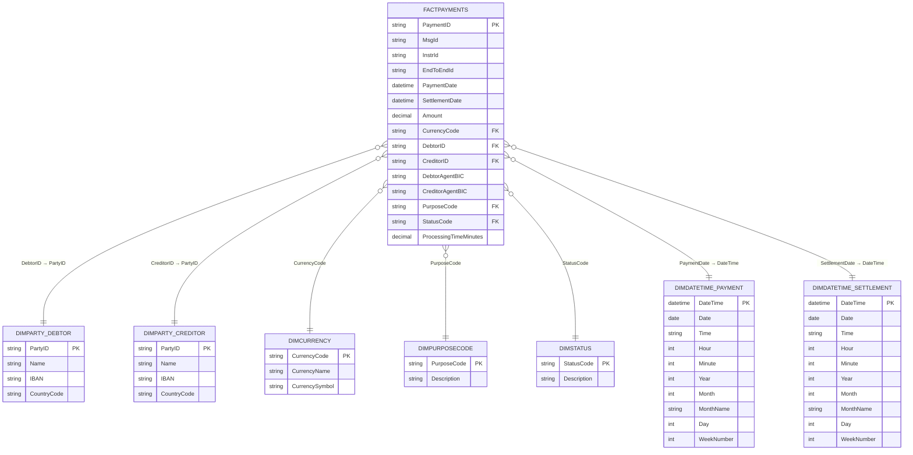

```mermaid
erDiagram
    FACTPAYMENTS {
        string PaymentID PK
        string MsgId
        string InstrId
        string EndToEndId
        datetime PaymentDate
        datetime SettlementDate
        decimal Amount
        string CurrencyCode FK
        string DebtorID FK
        string CreditorID FK
        string DebtorAgentBIC
        string CreditorAgentBIC
        string PurposeCode FK
        string StatusCode FK
        decimal ProcessingTimeMinutes
    }

    DIMPARTY_DEBTOR {
        string PartyID PK
        string Name
        string IBAN
        string CountryCode
    }

    DIMPARTY_CREDITOR {
        string PartyID PK
        string Name
        string IBAN
        string CountryCode
    }

    DIMCURRENCY {
        string CurrencyCode PK
        string CurrencyName
        string CurrencySymbol
    }

    DIMPURPOSECODE {
        string PurposeCode PK
        string Description
    }

    DIMSTATUS {
        string StatusCode PK
        string Description
    }

    DIMDATETIME_PAYMENT {
        datetime DateTime PK
        date Date
        string Time
        int Hour
        int Minute
        int Year
        int Month
        string MonthName
        int Day
        int WeekNumber
    }

    DIMDATETIME_SETTLEMENT {
        datetime DateTime PK
        date Date
        string Time
        int Hour
        int Minute
        int Year
        int Month
        string MonthName
        int Day
        int WeekNumber
    }

    FACTPAYMENTS }o--|| DIMPARTY_DEBTOR : "DebtorID → PartyID"
    FACTPAYMENTS }o--|| DIMPARTY_CREDITOR : "CreditorID → PartyID"
    FACTPAYMENTS }o--|| DIMCURRENCY : "CurrencyCode"
    FACTPAYMENTS }o--|| DIMPURPOSECODE : "PurposeCode"
    FACTPAYMENTS }o--|| DIMSTATUS : "StatusCode"
    FACTPAYMENTS }o--|| DIMDATETIME_PAYMENT : "PaymentDate → DateTime"
    FACTPAYMENTS }o--|| DIMDATETIME_SETTLEMENT : "SettlementDate → DateTime"
```
