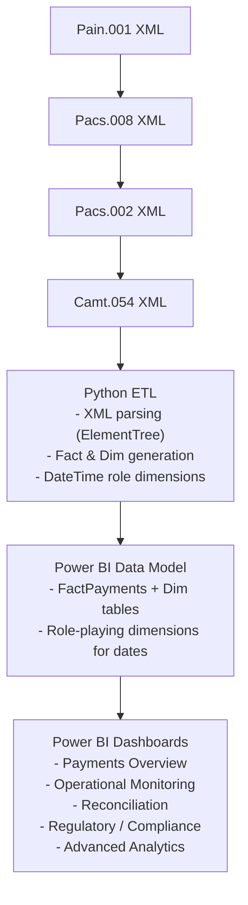

```mermaid
flowchart TD
    A[Pain.001 XML] --> B[Pacs.008 XML]
    B --> C[Pacs.002 XML]
    C --> D[Camt.054 XML]
    D --> E["Python ETL\n- XML parsing (ElementTree)\n- Fact & Dim generation\n- DateTime role dimensions"]
    E --> F["Power BI Data Model\n- FactPayments + Dim tables\n- Role-playing dimensions for dates"]
    F --> G["Power BI Dashboards\n- Payments Overview\n- Operational Monitoring\n- Reconciliation\n- Regulatory / Compliance\n- Advanced Analytics"]
```