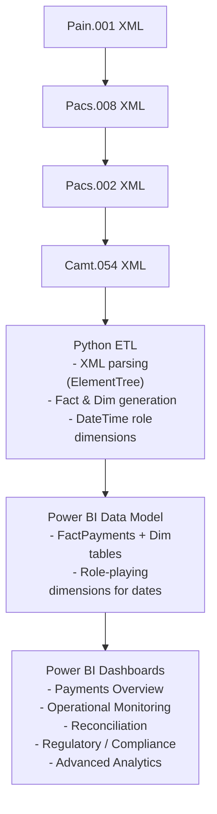

```mermaid
flowchart TD
    A[Pain.001 XML] --> B[Pacs.008 XML]
    B --> C[Pacs.002 XML]
    C --> D[Camt.054 XML]
    D --> E["Python ETL
    - XML parsing (ElementTree)
    - Fact & Dim generation
    - DateTime role dimensions"]
    E --> F["Power BI Data Model
    - FactPayments + Dim tables
    - Role-playing dimensions for dates"]
    F --> G["Power BI Dashboards
    - Payments Overview
    - Operational Monitoring
    - Reconciliation
    - Regulatory / Compliance
    - Advanced Analytics"]
```